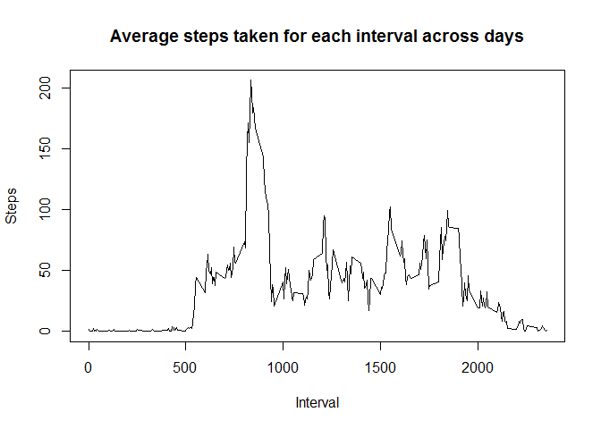

# Reprouducible research assignment
Norman Byer  
April 3, 2016  

## Loading and preprocessing the data

open the file and remove any with missing fields

```r
rawdataset <- read.csv(unz("repdata_data_activity.zip","activity.csv"))
dataset <- rawdataset
dataset <- dataset[!is.na(dataset$steps),]
dataset <- dataset[!is.na(dataset$date),]
dataset <- dataset[!is.na(dataset$interval),]
```

## What is mean total number of steps taken per day?
plot the daily steps

```r
dailysteps <- tapply(dataset$steps,dataset$date,sum)
hist(dailysteps)
```


calculate the mean and median day ignoring days with no steps recorded

```r
dailyaveragesteps <- tapply(dataset$steps,dataset$date,mean)
meanDay = mean(dailysteps,na.rm=TRUE)
medianDay = median(dailysteps,na.rm = TRUE)
print(meanDay)
```

```
## [1] 10766.19
```

```r
print(medianDay)
```

```
## [1] 10765
```

## What is the average daily activity pattern?
calculate the average steps per interval

```r
intervalAverageSteps <- by(dataset,dataset$interval,
                               function(x){
                                 temp = data.frame(
                                    x$interval[1],
                                    mean(x$steps),
                                    row.names = 1
                                    )
                                 return(temp)
                                 })
temp <- (do.call(rbind,intervalAverageSteps))
plot(temp,main = "Average steps taken for each interval across days",xlab = "Interval", ylab = "Steps",type="l")
```



```r
maxStepsValue <- max(temp[2])
maxStepsInterval <- temp[maxStepsValue==temp[2],1]

print(maxStepsValue)
```

```
## [1] 206.1698
```

```r
print(maxStepsInterval)
```

```
## [1] 835
```

## Imputing missing values
find number of missing values then fill them with the average for that interval 

```r
datasetB = rawdataset
print(sum(is.na(datasetB$steps)))
```

```
## [1] 2304
```

```r
for(i in 1:length(datasetB$steps)){
  if(is.na(datasetB[i,"steps"])){
    datasetB[i,"steps"] = temp[temp[1] == datasetB[i,"interval"]][2]
  }
}
```
repeat earlier analysis of mean for days
plot the daily steps

```r
dailysteps <- tapply(datasetB$steps,datasetB$date,sum)
hist(dailysteps)
```


list total steps and average steps

```r
dailyaveragesteps <- tapply(datasetB$steps,datasetB$date,mean)
meanDay = mean(dailysteps,na.rm=TRUE)
medianDay = median(dailysteps,na.rm = TRUE)
print(meanDay)
```

```
## [1] 10766.19
```

```r
print(medianDay)
```

```
## [1] 10766.19
```
the plot did not change shape much however the peak grew higher
the mean stayed the same but the median became equal to the mean

## Are there differences in activity patterns between weekdays and weekends?

```r
datasetB["factor"] <- weekdays(as.Date(as.character(datasetB$date)),TRUE)
datasetB[datasetB$factor %in% c("Sat","Sun"),"factor"] <- "weekend"
datasetB[datasetB$factor %in% c("Mon","Tue","Wed","Thu","Fri"),"factor"] <- "weekday"
temp <- split(datasetB,datasetB$factor)
par(mfrow=c(2,1),mar=c(2,2,2,0))
weekdays <- temp$weekday
weekends <- temp$weekend
weekdayaverages <- by(weekdays,weekdays$interval,
                               function(x){
                                 temp = data.frame(
                                    x$interval[1],
                                    mean(x$steps),
                                    row.names = 1
                                    )
                                 return(temp)
                                 })
temp <- (do.call(rbind,weekdayaverages))
plot(temp,main = "Average steps taken for each interval",xlab = "",ylab="",type="l",mar=c(0,2,2,0))
mtext("weekdays")

weekendaverages <- by(weekends,weekends$interval,
                               function(x){
                                 temp = data.frame(
                                    x$interval[1],
                                    mean(x$steps),
                                    row.names = 1
                                    )
                                 return(temp)
                                 })
temp <- (do.call(rbind,weekendaverages))
plot(temp,xlab = "", ylab = "",type="l",mar=c(1,2,1,0))
mtext("weekends")
title(xlab = "Interval",
      ylab = "Steps",
      outer = TRUE, line = 3)
```


